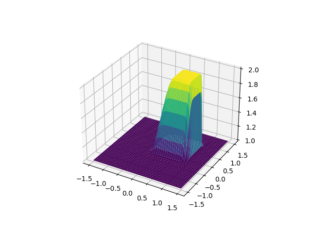
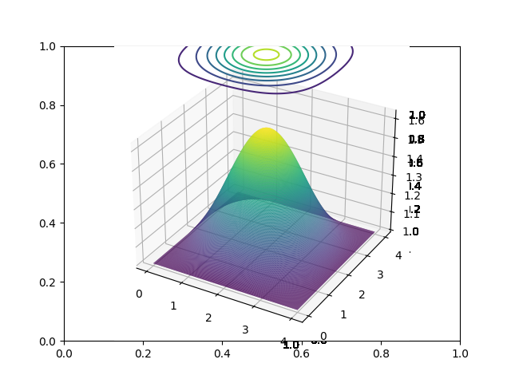
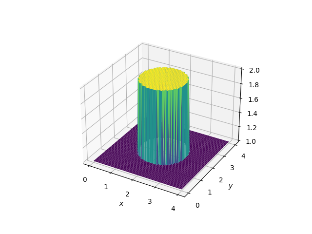
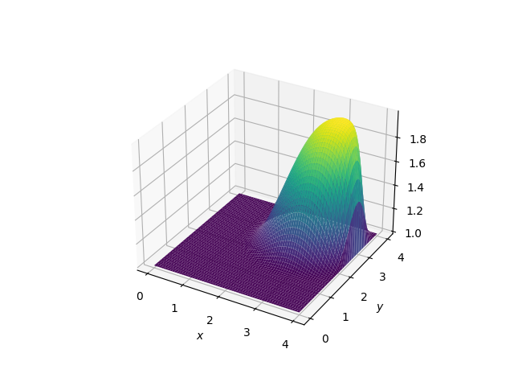
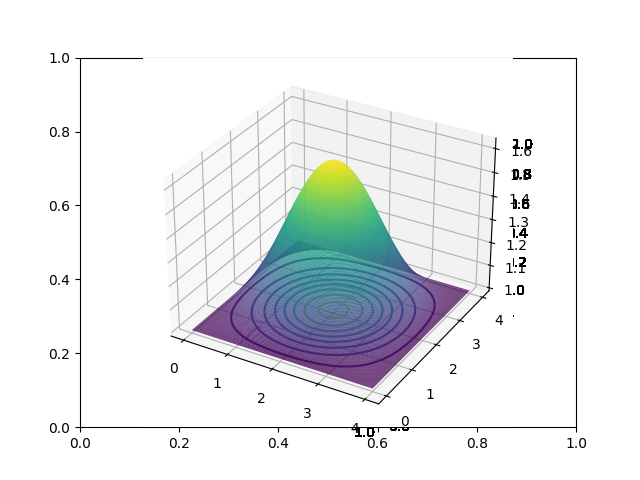

# Exp5.0_2DNonLinearConvection.py

Modelling convection current fluid in 2D. 

# Exp5.1_2DDiffusionEqution.py

Simulation of a cylindrical fluid diffusion process with contour lines at the end of the simulation representing the change of density. 

# Exp5.2_2DBurgersEqution.py

Simulation of a cylinderical fluid moving in 2D plane.

At beginning:

Simulation result:

# Exp5.2_2DDiffusionEqution.py

Simulation of a cylinderical fluid in diffusion process.

At beginning:

Simulation result:

