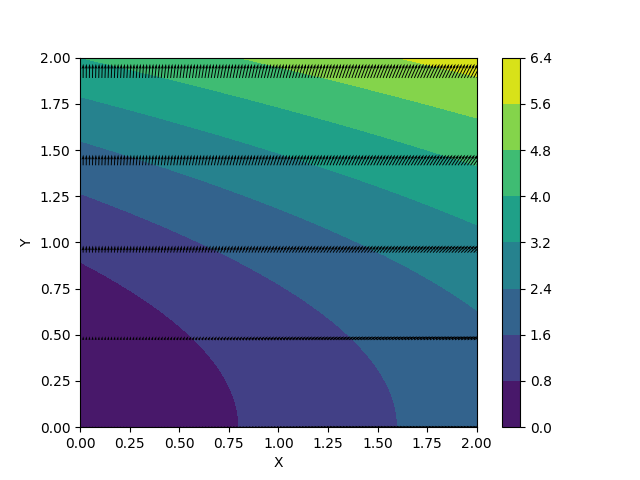
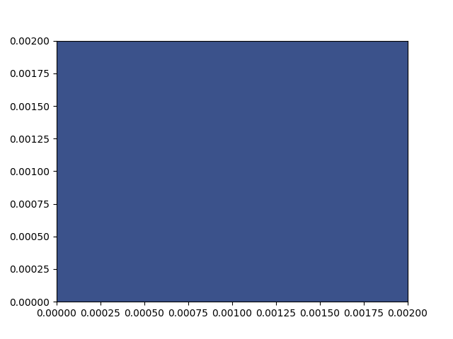
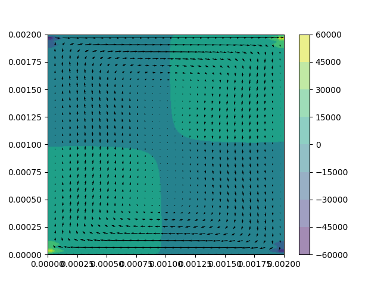
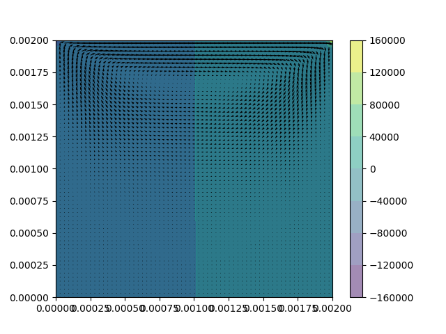
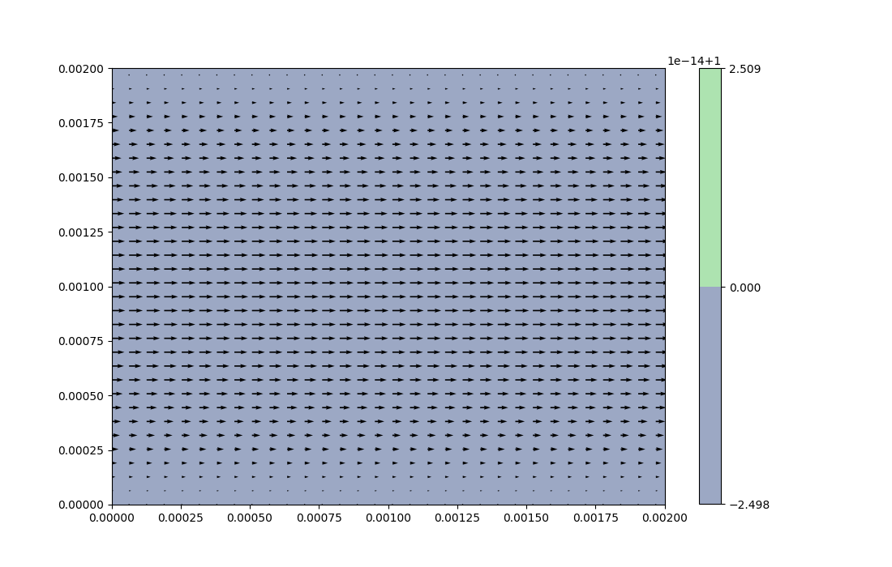

# Exp7.0_multiVariablePlot.py

Practice on plotting vector field.

Simulation result:

# Exp7.1_NaiveStokesEquation_incompressble_cavity.py

Simulation of fluid using NS-Equation with fluid having initial velocity of 1 unit per time step (to the right of the plot)

At beginning:

Simulation result:

# Exp7.1_NaiveStokesEquation_incompressble_cavity_saveFig.py

The same core as "Exp7.1_NaiveStokesEquation_incompressble_cavity.py", although added screenshot function at beginning and at the end of the simualtion. 

At beginning:

Simulation result:

# Exp7.2_NaiveStokesEquation_incompressble_channel.py

Simualtion of fluid with initial velocity in channel (top and bottom plane solid, left and right side open)

Simulation result:

