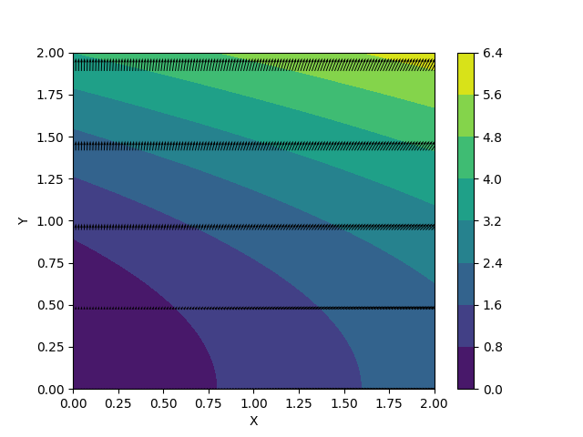
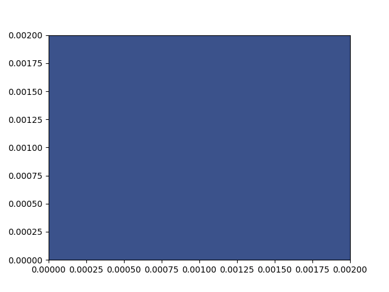
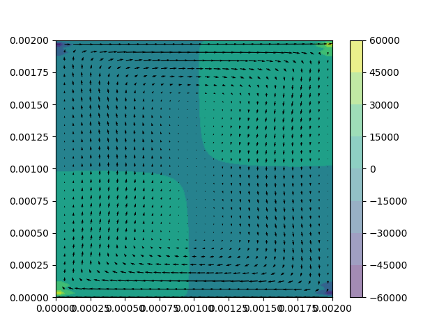
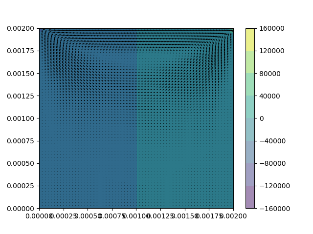

# Exp7.0_multiVariablePlot.py

# Exp7.1_NaiveStokesEquation_incompressble_cavity.py

# Exp7.1_NaiveStokesEquation_incompressble_cavity_saveFig.py

# Exp7.2_NaiveStokesEquation_incompressble_channel.py

