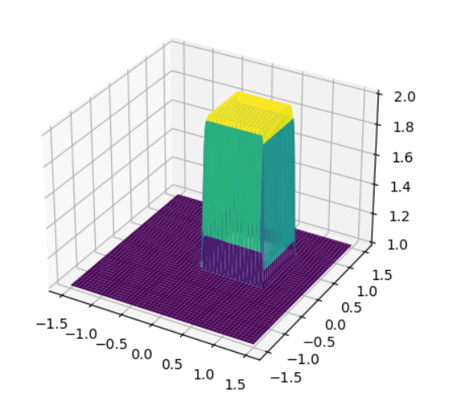

# NS-Equation_practice_coding
Fluid Simulation using cpp with NS-equation

This repository contains codes with a few equations related to the fluid dynamic will will shows the simulation results below for each of the Exp.

## Exp1_LinearConvection.py 

This file aim to familiar with the python plotting libarary (pyplot). 
Generating a wave as "dots" in the cells that are written from line 21 to line 25 and gives initial velocity at line 16(all moves with the same velocity). 

Line 32 to 42 will calculate the next stage of wave and plot them on the graph and puase of dt. The simuation will undergoes a loop and clear last graph. 

## Exp2_DiffusionEquation.py

 

## Exp3_BurgerEquation.py

## 4.1_3DPlot.py

This is a practice of using 3D plotting in python. 

## Exp4.2_2DLinearConvection_Swift.py

 

## Exp5.1_2DDiffusionEqution.py
