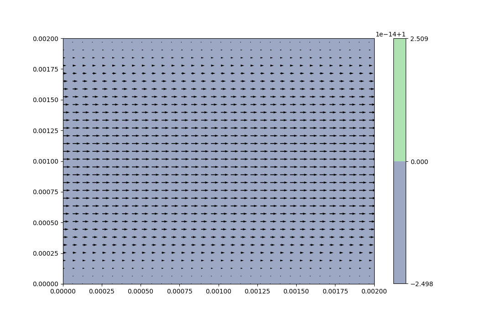

# NS-Equation_practice_coding
Fluid Simulation using cpp with NS-equation

This repository contains codes with a few equations related to the fluid dynamic will will shows the simulation results below for each of the Exp.

